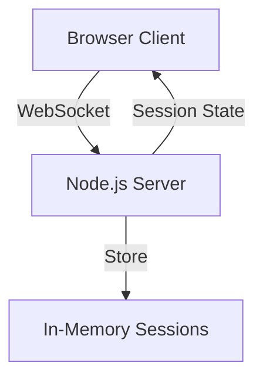

# Scrum Poker

A real-time web application for conducting Planning Poker sessions during Agile estimations, allowing distributed teams to vote simultaneously and reveal their estimates together.

## Architecture



### Components

- **Frontend (Browser Client)**:

  - Pure HTML and JavaScript
  - WebSocket client for real-time updates
  - Proxy object for reactive updates when state changes

- **Backend (Node.js Server)**:
  - Express.js web server for static file serving
  - WebSocket server for real-time communication
  - In-memory session storage with UUID-based keys
  - Maintains vote state (hidden/revealed)
  - Cleans up inactive sessions automatically
  - Handles user joins/disconnects and vote updates

## Setup

1. Clone the repository:

```bash
git clone https://github.com/yourusername/scrum-poker.git
cd scrum-poker
```

2. Install dependencies:

```bash
npm install
```

3. Start the development server:

```bash
npm run dev
```

4. Open `http://localhost:3000` in your browser (port may vary if 3000 is in use)

## Development

- Run in development mode with hot reload: `npm run dev`
- Build TypeScript for production: `npm run build`
- Start production server: `npm start`
- Run type checking: `npm run type-check`
