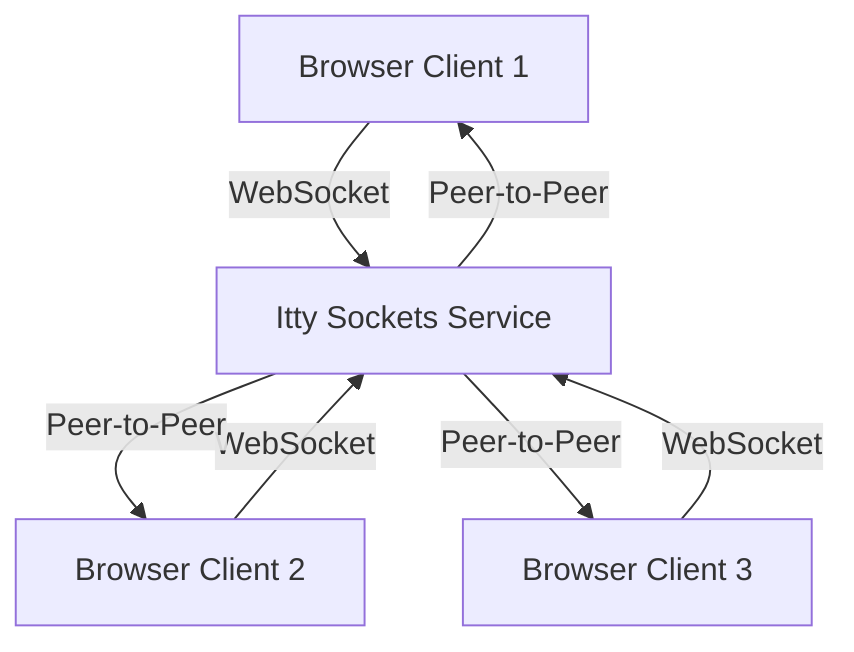

# Scrum Poker

A real-time web application for conducting Planning Poker sessions during Agile estimations, allowing distributed teams to vote simultaneously and reveal their estimates together.

## Architecture



### Components

- **Frontend (Browser Client)**:
  - Pure HTML and JavaScript
  - [Itty Sockets](https://ittysockets.com/) client for real-time peer-to-peer communication
  - Proxy object for reactive updates when state changes
  - Playing card UI components for voting
  - Confetti animation for matching votes
  - No backend server required - fully client-side

- **Communication Layer**:
  - Itty Sockets service for real-time messaging
  - Peer-to-peer communication through WebSocket channels
  - No data persistence - sessions exist only while users are connected
  - Private channels based on session IDs

## Setup

1. Clone the repository:

```bash
git clone https://github.com/yourusername/scrum-poker.git
cd scrum-poker
```

2. Serve the application:

Since this is now a fully client-side application, you can serve it using any static file server:

**Option 1: Python (if you have Python installed)**
```bash
cd public
python3 -m http.server 8080
```

**Option 2: Node.js (if you have Node.js installed)**
```bash
npx serve public -p 8080
```

**Option 3: Any other static file server**
- Simply serve the `public` directory using your preferred method

3. Open `http://localhost:8080` in your browser

## Usage

1. **Start a New Session**: Click "Start New Session" to create a new planning poker session
2. **Share the URL**: Copy the session URL and share it with your team members
3. **Join the Session**: Team members enter their names and join the session
4. **Vote**: Each team member selects their story point estimate
5. **Reveal**: Click "Reveal Votes" to show all estimates simultaneously
6. **Discuss**: Review the estimates and discuss any discrepancies
7. **Clear**: Use "Clear Votes" to start a new round of voting

## Features

- **Real-time Communication**: Uses [Itty Sockets](https://ittysockets.com/) for instant peer-to-peer messaging
- **No Backend Required**: Fully client-side application with no server dependencies
- **Private Sessions**: Each session uses a unique channel ID for privacy
- **Responsive Design**: Works on desktop and mobile devices
- **Confetti Animation**: Celebrates when all team members agree on estimates
- **User Management**: Remove users from sessions as needed

## Development

- **No Build Process**: Pure HTML/CSS/JavaScript - edit files directly
- **Test Page**: Use `test.html` to test the Itty Sockets integration
- **Console Logging**: All messages include 🦄 emoji for easy debugging
